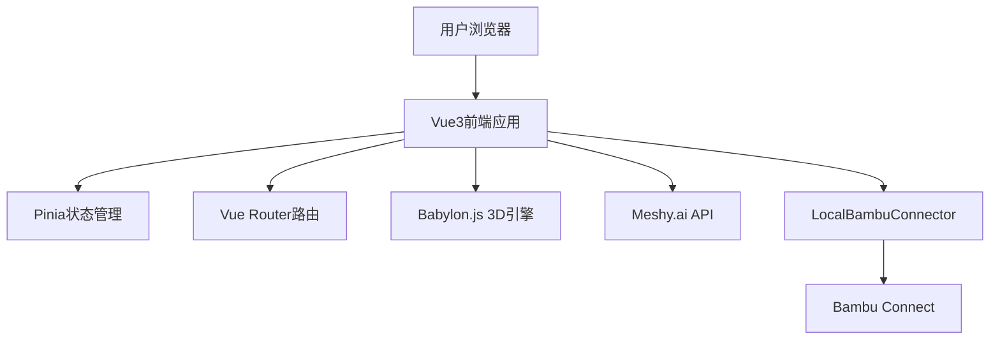

# 🚀 3D生成打印平台

> 基于Vue3的现代化AI驱动3D模型生成与打印平台

[](https://vuejs.org/)
[](https://www.typescriptlang.org/)
[](https://www.babylonjs.com/)

## ✨ 核心特性

- 🤖 **AI驱动生成**: 使用Meshy.ai提供文本和图片到3D模型的转换
- 🎨 **专业3D查看器**: 基于Babylon.js的高性能3D模型预览和编辑
- 🖨️ **无缝打印集成**: 通过Bambu Connect URL Scheme直接发送到3D打印机
- ⚡ **现代化技术栈**: Vue3 + TypeScript + Vite实现快速开发和优异性能
- 📦 **本地化方案**: 无需复杂SDK,通过LocalBambuConnector实现本地化集成

## 🎯 目标用户

| 用户群体 | 使用场景 | 核心需求 |
|---------|---------|---------|
| **设计师** | 快速原型设计和迭代 | 高质量模型生成、精细编辑 |
| **创客** | 个人创作和小批量生产 | 简单易用、快速打印 |
| **3D打印爱好者** | 模型收集和打印测试 | 模型库管理、打印优化 |
| **教育机构** | 教学演示和学生项目 | 批量处理、协作功能 |
| **专业用户** | 商业原型制作 | 高级功能、API集成 |

## 🛠️ 技术架构

### 核心技术栈



### 技术选型

- **前端框架**: Vue3 + TypeScript + Vite
- **UI框架**: Tailwind CSS + 自定义组件
- **3D引擎**: Babylon.js 6.0+
- **状态管理**: Pinia 2.1+
- **路由管理**: Vue Router 4.2+
- **HTTP客户端**: Axios
- **AI服务**: Meshy.ai API
- **打印集成**: Bambu Connect URL Scheme

## 📚 文档结构

### 核心文档

1. **[claude.md](./claude.md)** - Vue3技术栈说明和开发指南
2. **[产品需求文档](./docs/3D生成打印平台产品需求文档.md)** - 完整的产品功能需求和用户流程
3. **[技术架构文档](./docs/3D生成打印平台技术架构文档.md)** - 系统架构和技术实现方案
4. **[API接口设计文档](./docs/API接口设计文档.md)** - Meshy.ai和LocalBambuConnector接口设计
5. **[UI界面设计文档](./docs/UI界面设计文档.md)** - 完整的界面设计规范和Vue3组件实现
6. **[架构文档优化总结](./docs/架构文档优化总结.md)** - 架构优化过程和技术决策

### 文档阅读指南

```
推荐阅读顺序:

新开发者入门:
  README.md (本文档)
    ↓
  产品需求文档 → 了解产品定位和功能
    ↓
  claude.md → 掌握Vue3技术栈
    ↓
  技术架构文档 → 理解系统架构
    ↓
  UI界面设计文档 + API接口设计文档 → 开始开发

前端开发者:
  claude.md + UI界面设计文档 + API接口设计文档

架构设计者:
  技术架构文档 + 架构文档优化总结 + claude.md
```

## 🚀 快速开始

### 环境要求

- Node.js 18+
- npm 9+ 或 pnpm 8+

### 安装依赖

```bash
# 克隆项目
git clone https://github.com/sunqirui1987/qiniu-hackathon-3d.git
cd qiniu-hackathon-3d

# 安装依赖
npm install

# 或使用 pnpm
pnpm install
```

### 配置后端服务

**重要**: 后端服务与前端是分离的项目,运行在独立的服务器上。

#### 前端配置

1. 复制环境变量配置文件:
```bash
cp .env.example .env
```

2. 编辑 `.env` 文件,设置后端服务器地址:
```bash
# 开发环境示例
VITE_API_BASE_URL=http://localhost:3000

# 生产环境示例
VITE_API_BASE_URL=https://api.yourdomain.com
```

#### 后端运行要求

**认证后端服务需要使用 Bun 运行时:**

```bash
# 安装 Bun (如果尚未安装)
curl -fsSL https://bun.sh/install | bash

# 启动认证服务器
npm run auth-server
# 或直接运行
bun auth-server.js
```

详细的后端配置说明请参考 [认证后端文档](./docs/AUTH_README.md)

### 开发

```bash
# 启动开发服务器
npm run dev

# 访问 http://localhost:5173
```

### 构建

```bash
# 生产构建
npm run build

# 预览生产构建
npm run preview
```

## 🔧 主要功能模块

### 1. 3D生成模块
- **文本到3D**: 输入文本描述,AI自动生成3D模型
- **图片到3D**: 上传图片,转换为3D模型
- **参数设置**: 质量、风格、尺寸等高级选项
- **任务管理**: 生成队列、进度监控、结果预览

### 2. 3D查看器
- **实时渲染**: 基于Babylon.js的高性能3D渲染
- **交互控制**: 旋转、缩放、平移等视角操作
- **模型编辑**: 变换、材质、颜色等属性编辑
- **测量工具**: 尺寸测量、距离计算

### 3. 打印管理
- **Bambu连接**: 自动检测和连接Bambu Connect
- **打印设置**: 层高、填充密度、支撑材料等参数
- **队列管理**: 打印任务列表和优先级设置
- **状态监控**: 实时查看打印状态

### 4. 模型库
- **文件管理**: 本地文件浏览和分类整理
- **预览功能**: 缩略图显示和快速预览
- **搜索过滤**: 按名称、标签、日期搜索
- **批量操作**: 批量删除、导出、分享

## 🔗 外部集成

### Meshy.ai API
- Text-to-3D生成
- Image-to-3D转换
- 模型精细化和纹理生成
- [API文档](./docs/API接口设计文档.md#3-meshyai-api-接口)

### Bambu Connect
- URL Scheme集成
- 本地文件传输
- 打印机自动发现
- [集成文档](./docs/API接口设计文档.md#4-bambu-connect-集成方案)

## 📦 项目结构

```
src/
├── components/          # Vue组件
│   ├── 3d/             # 3D相关组件
│   ├── ui/             # 通用UI组件
│   ├── forms/          # 表单组件
│   └── print/          # 打印相关组件
├── views/              # 页面组件
│   ├── Home.vue        # 主页
│   ├── Generate.vue    # 3D生成页面
│   ├── Viewer.vue      # 3D查看器
│   ├── Print.vue       # 打印管理
│   └── Library.vue     # 模型库
├── composables/        # 组合式函数
│   ├── use3D.ts        # 3D相关逻辑
│   ├── useBambu.ts     # Bambu Connect集成
│   ├── useMeshyAPI.ts  # Meshy.ai API集成
│   └── useFileManager.ts # 文件管理
├── stores/             # Pinia状态管理
│   ├── model.ts        # 模型状态
│   ├── print.ts        # 打印任务状态
│   └── ui.ts           # UI状态
├── utils/              # 工具函数
└── types/              # TypeScript类型定义
```

## 🎨 开发规范

### Vue3组件开发

```vue
<template>
  <!-- 使用Tailwind CSS -->
  <div class="flex flex-col space-y-4">
    <!-- 组件内容 -->
  </div>
</template>

<script setup lang="ts">
// 使用 <script setup> 语法糖
import { ref, computed, onMounted } from 'vue'

// Props定义
interface Props {
  modelId?: string
}

const props = withDefaults(defineProps<Props>(), {
  modelId: ''
})

// 响应式数据
const isLoading = ref(false)

// 计算属性
const displayName = computed(() => {
  return props.modelId || '未命名'
})

// 生命周期
onMounted(() => {
  // 初始化逻辑
})
</script>

<style scoped>
/* 必要时使用scoped样式 */
</style>
```

### TypeScript类型定义

```typescript
// types/model.ts
export interface Model3D {
  id: string
  name: string
  url: string
  format: '3mf' | 'stl' | 'obj' | 'glb'
  createdAt: Date
}

export interface GenerateOptions {
  quality: 'low' | 'medium' | 'high'
  style: 'realistic' | 'cartoon'
}
```

## 🤝 贡献指南

1. Fork 本项目
2. 创建特性分支 (`git checkout -b feature/AmazingFeature`)
3. 提交更改 (`git commit -m 'Add some AmazingFeature'`)
4. 推送到分支 (`git push origin feature/AmazingFeature`)
5. 提交 Pull Request

## 📄 许可证

本项目采用 MIT 许可证 - 详见 [LICENSE](LICENSE) 文件

## 🙏 致谢

- [Vue.js](https://vuejs.org/) - 渐进式JavaScript框架
- [Babylon.js](https://www.babylonjs.com/) - 强大的3D引擎
- [Meshy.ai](https://www.meshy.ai/) - AI驱动的3D生成服务
- [Bambu Lab](https://bambulab.com/) - 3D打印机和Bambu Connect

## 📞 联系方式

- 项目主页: [GitHub](https://github.com/sunqirui1987/qiniu-hackathon-3d)
- 问题反馈: [Issues](https://github.com/sunqirui1987/qiniu-hackathon-3d/issues)

---

**打造从创意到实物的完整工作流** 🚀
