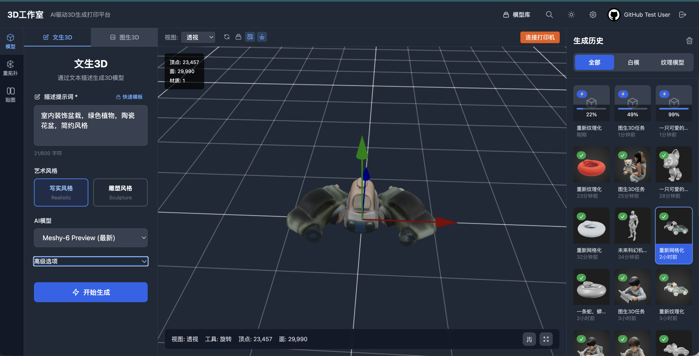
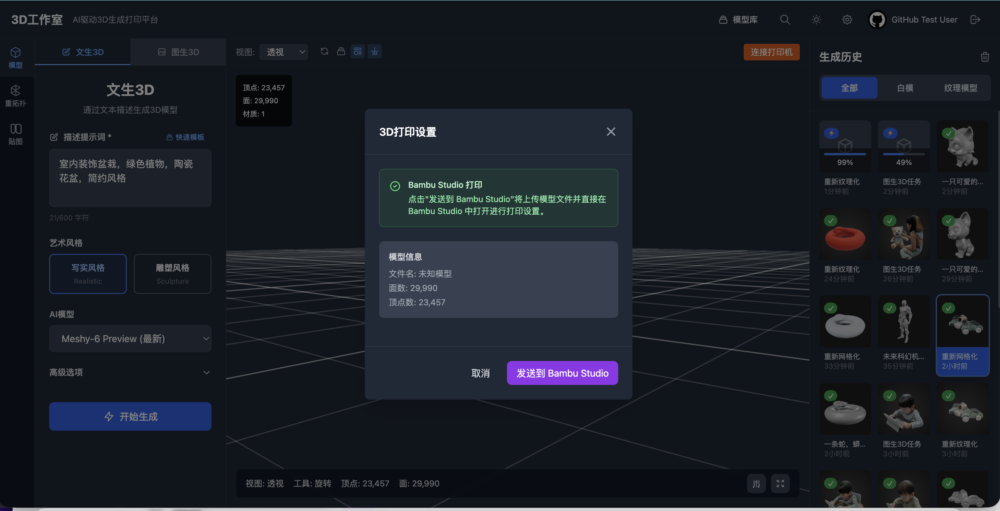
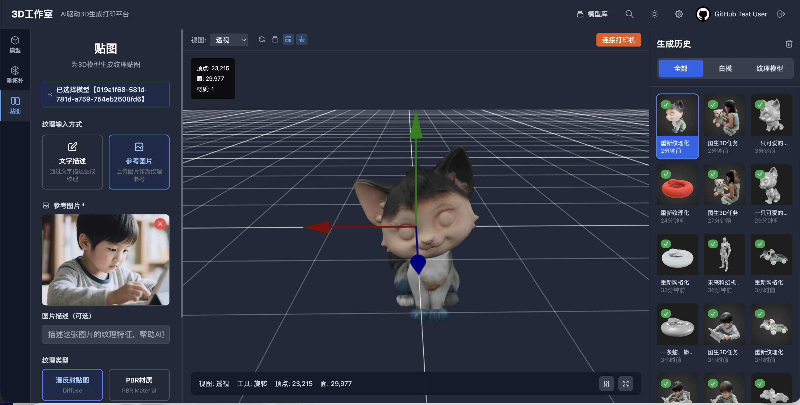
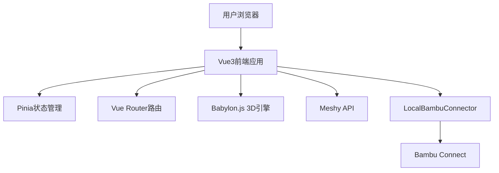

# 🚀 3D生成打印平台

> 基于Vue3的现代化AI驱动3D模型生成与打印平台

[](https://vuejs.org/)
[](https://www.typescriptlang.org/)
[](https://www.babylonjs.com/)

## ✨ 核心特性

- 🤖 **AI驱动生成**: 使用Meshy.ai提供文本和图片到3D模型的转换
- 🎨 **专业3D查看器**: 基于Babylon.js的高性能3D模型预览和编辑
- 🖨️ **无缝打印集成**: 通过Bambu Connect URL Scheme直接发送到3D打印机
- ⚡ **现代化技术栈**: Vue3 + TypeScript + Vite实现快速开发和优异性能
- 📦 **本地化方案**: 无需复杂SDK,通过LocalBambuConnector实现本地化集成

## 📸 项目效果展示

### 界面截图

<div align="center">


*主界面 - 现代化的用户界面设计*


*3D生成界面 - AI驱动的模型生成*


*3D查看器 - 基于Babylon.js的高性能渲染*

</div>

### 功能演示视频

<div align="center">

https://github.com/user-attachments/assets/f84210b4-45a2-40b3-86b2-8f837f5ca719

*完整功能演示 - 从文本生成到3D打印的完整工作流*

</div>

> 💡 **提示**: 如果视频无法正常播放，请下载 [演示视频](./docs/screen/screenrecord.mp4) 本地查看

## 🎯 目标用户

| 用户群体 | 使用场景 | 核心需求 |
|---------|---------|---------|
| **设计师** | 快速原型设计和迭代 | 高质量模型生成、精细编辑 |
| **创客** | 个人创作和小批量生产 | 简单易用、快速打印 |
| **3D打印爱好者** | 模型收集和打印测试 | 模型库管理、打印优化 |
| **教育机构** | 教学演示和学生项目 | 批量处理、协作功能 |
| **专业用户** | 商业原型制作 | 高级功能、API集成 |

## 🛠️ 技术架构

### 核心技术栈



## 🚀 快速开始

### 📋 环境要求

| 工具 | 版本要求 | 用途 | 安装状态检查 |
|------|----------|------|-------------|
| **Node.js** | 18.0+ | 运行时环境 | `node --version` |
| **npm** | 9.0+ | 包管理器 | `npm --version` |
| **pnpm** | 8.0+ (推荐) | 快速包管理器 | `pnpm --version` |

> 💡 **提示**: 推荐使用 pnpm 以获得更快的安装速度和更好的磁盘空间利用率

### 📦 一键启动指南

#### 步骤1: 获取项目代码

```bash
# 克隆项目
git clone https://github.com/sunqirui1987/qiniu-hackathon-3d.git
cd qiniu-hackathon-3d

# 安装依赖 (选择其一)
npm install          # 使用 npm
pnpm install         # 使用 pnpm (推荐)
```

#### 步骤2: 环境配置

```bash
# 复制环境变量配置文件
cp .env.example .env
cp .env.auth.example .env.auth
```

**配置前端环境变量** (编辑 `.env` 文件)：
```env
# 后端API服务地址
VITE_API_BASE_URL=http://localhost:3001
```

**配置认证服务** (编辑 `.env.auth` 文件)：
```env
# 基础配置
NODE_ENV=development
AUTH_PORT=3001
FRONTEND_URL=http://localhost:5173


# 数据库配置
DB_TYPE=sqlite
BCRYPT_SALT_ROUNDS=12
```

> ⚠️ **安全提醒**: 生产环境部署时，请务必修改 JWT 密钥和其他敏感配置

#### 步骤3: 启动服务

**🔥 快速启动 (推荐)**

```bash
# 方式1: 分别启动 (便于调试)
# 终端1: 启动认证后端服务
npm run auth-server

# 终端2: 启动前端开发服务器  
npm run dev
```

**🚀 PM2 生产模式启动**

```bash
# 安装 PM2 (如果尚未安装)
npm install -g pm2

# 启动所有服务
npm run pm2:start

# 查看服务状态
npm run pm2:status

# 查看日志
npm run pm2:logs

# 停止服务
npm run pm2:stop
```

#### 步骤4: 验证部署

访问以下地址确认服务正常运行：

| 服务 | 地址 | 状态检查 |
|------|------|----------|
| 🎨 **前端应用** | http://localhost:5173 | 应显示登录界面 |
| 🔐 **认证API** | http://localhost:3001 | 返回API状态信息 |

### 🛠️ 开发工具命令

```bash
# 开发服务器 (热重载)
npm run dev

# 类型检查
npm run type-check

# 代码检查和格式化
npm run lint
npm run format

# 测试
npm run test          # 前端测试
npm run test:server   # 后端测试
npm run test:ui       # 测试UI界面
```

### 🏗️ 构建和部署

```bash
# 构建生产版本
npm run build

# 本地预览构建结果
npm run preview

# PM2 生产环境管理
npm run pm2:start     # 启动
npm run pm2:reload    # 重载
npm run pm2:stop      # 停止
```

### 🐛 故障排除

#### 🔍 常见问题诊断

<details>
<summary><strong>1. 端口占用问题</strong></summary>

```bash
# 检查端口占用情况
lsof -i :3001  # 检查认证服务端口
lsof -i :5173  # 检查前端服务端口

# 终止占用进程 (谨慎使用)
kill -9 $(lsof -t -i:3001)

# 或修改端口配置
# 在 .env.auth 中修改 AUTH_PORT
# 在 .env 中修改 VITE_API_BASE_URL
```
</details>

<details>
<summary><strong>2. 依赖安装失败</strong></summary>

```bash
# 清理并重新安装
rm -rf node_modules package-lock.json pnpm-lock.yaml
npm cache clean --force

# 重新安装
npm install
# 或
pnpm install --frozen-lockfile
```
</details>

<details>
<summary><strong>3. 环境变量配置错误</strong></summary>

```bash
# 检查环境文件是否存在
ls -la .env*

# 验证环境变量格式
cat .env
cat .env.auth

# 确保没有多余的空格或特殊字符
```
</details>

<details>
<summary><strong>4. 数据库连接问题</strong></summary>

```bash
# 检查 SQLite 数据库文件权限
ls -la *.db

# 重置数据库 (谨慎使用，会丢失数据)
rm -f *.db
npm run auth-server  # 重新创建数据库
```
</details>

<details>
<summary><strong>5. PM2 服务管理问题</strong></summary>

```bash
# 查看 PM2 进程状态
pm2 list

# 查看详细日志
pm2 logs --lines 50

# 重启特定服务
pm2 restart auth-server

# 完全重置 PM2
pm2 kill
pm2 resurrect
```
</details>

#### 📊 性能监控

```bash
# 查看系统资源使用
npm run pm2:status

# 实时日志监控
npm run pm2:logs

# 查看详细进程信息
pm2 show auth-server
```

#### 🆘 获取帮助

如果遇到其他问题，请：

1. 📋 查看 [Issues](https://github.com/sunqirui1987/qiniu-hackathon-3d/issues) 页面
2. 📖 阅读 [技术文档](./docs/) 目录下的详细文档
3. 🐛 提交新的 Issue 并附上错误日志
