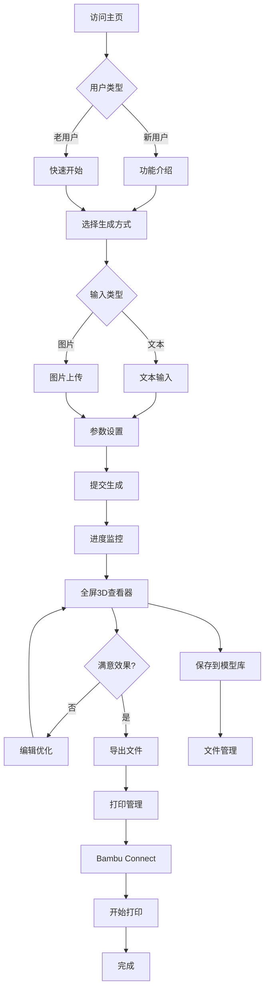

# 3D生成打印平台产品需求文档

## 1. Product Overview

3D生成打印平台是一个基于Vue3的现代化AI驱动3D模型生成与打印平台，提供文本到3D模型生成、图片到3D模型转换、专业3D查看器以及与Bambu Connect的本地化打印集成功能。
- 通过AI技术实现从创意到实物的完整工作流程，支持文本描述和图片输入两种生成方式。
- 目标用户：设计师、创客、3D打印爱好者、教育机构以及需要快速原型制作的专业用户。
- 产品价值：降低3D建模门槛，提高创意实现效率，打通设计到制造的完整链路。

## 2. Core Features

### 2.1 用户角色

| 角色 | 注册方式 | 核心权限 |
|------|----------|----------|
| 普通用户 | 邮箱注册或游客模式 | 基础3D生成、模型查看、本地文件管理 |
| 高级用户 | 付费升级 | 高质量生成、批量处理、云端同步、高级编辑功能 |

### 2.2 Feature Module

我们的3D生成打印平台包含以下核心页面：
1. **主页**：项目入口，功能导航和快速开始
2. **3D生成页面**：文本/图片转3D模型，参数设置和生成管理
3. **全屏3D查看器**：专业级3D模型查看、编辑和分析工具
4. **打印管理页面**：Bambu Connect集成，打印队列和状态监控
5. **模型库页面**：本地文件管理，模型历史和分类整理

### 2.3 Page Details

| Page Name | Module Name | Feature description |
|-----------|-------------|---------------------|
| 主页 | 导航区域 | 顶部导航栏，功能入口，用户状态显示 |
| 主页 | 快速开始 | 一键进入生成流程，最近项目展示，模板选择 |
| 主页 | 功能展示 | 平台功能介绍，使用教程，案例展示 |
| 3D生成页面 | 文本输入区 | 多行文本输入，提示词优化，历史记录 |
| 3D生成页面 | 图片上传区 | 拖拽上传，格式验证，预览功能，批量处理 |
| 3D生成页面 | 参数设置 | 生成质量，风格选择，尺寸设定，高级选项 |
| 3D生成页面 | 任务管理 | 生成队列，进度监控，结果预览，错误处理 |
| 全屏3D查看器 | 渲染画布 | Babylon.js引擎，高性能渲染，多视角切换 |
| 全屏3D查看器 | 工具栏 | 视角控制，测量工具，截图功能，全屏切换 |
| 全屏3D查看器 | 属性面板 | 模型信息，材质编辑，变换控制，导出选项 |
| 全屏3D查看器 | 侧边栏 | 文件树，图层管理，历史记录，设置面板 |
| 打印管理页面 | Bambu连接 | 设备检测，连接状态，URL Scheme集成 |
| 打印管理页面 | 打印队列 | 任务列表，优先级设置，批量操作，状态监控 |
| 打印管理页面 | 设置面板 | 打印参数，材料选择，质量设定，切片预览 |
| 模型库页面 | 文件管理 | 本地文件浏览，分类整理，搜索过滤，批量操作 |
| 模型库页面 | 预览功能 | 缩略图显示，快速预览，模型信息，标签管理 |

## 3. Core Process

**主要用户操作流程**：

**新用户流程**：
1. 访问主页 → 查看功能介绍 → 选择快速开始
2. 进入3D生成页面 → 选择输入方式（文本/图片）
3. 输入内容并设置参数 → 提交生成任务
4. 查看生成进度 → 进入全屏3D查看器预览
5. 编辑和优化模型 → 导出文件
6. 进入打印管理 → 连接Bambu Connect → 开始打印

**高级用户流程**：
1. 直接进入生成页面 → 批量处理任务
2. 使用高级参数和自定义设置
3. 在模型库中管理和组织文件
4. 使用专业3D查看器进行精细编辑
5. 批量打印和队列管理

## 4. User Interface Design

### 4.1 Design Style
- **主色调**：现代蓝 (#3B82F6) 和深空灰 (#1F2937)，体现科技感和专业性
- **辅助色**：成功绿 (#10B981)、警告橙 (#F59E0B)、错误红 (#EF4444)、紫色强调 (#8B5CF6)
- **按钮风格**：圆角按钮，渐变效果，微妙阴影，清晰的交互反馈
- **字体**：Inter字体，标题18-24px，正文14-16px，代码Fira Code
- **布局风格**：现代卡片式设计，网格布局，流畅动画过渡
- **图标风格**：Heroicons线性图标，统一16-24px尺寸，一致的视觉语言

### 4.2 Vue3组件设计规范
- **组件化架构**：每个功能模块独立封装为Vue3组件
- **Composition API**：使用`<script setup>`语法，逻辑清晰分离
- **TypeScript支持**：严格类型定义，提升开发体验
- **Tailwind CSS**：原子化CSS类，快速样式开发
- **响应式设计**：移动端适配，断点设计（sm/md/lg/xl）

### 4.3 Page Design Overview

| Page Name | Module Name | UI Elements |
|-----------|-------------|-------------|
| 主页 | 顶部导航 | Vue Router导航，用户头像，主题切换，搜索框 |
| 主页 | Hero区域 | 大标题，功能介绍，CTA按钮，背景动画 |
| 主页 | 功能卡片 | 网格布局，图标+描述，悬停效果，路由跳转 |
| 3D生成页面 | 输入面板 | 左侧固定面板，标签切换，表单验证，实时预览 |
| 3D生成页面 | 参数设置 | 折叠面板，滑块控件，下拉选择，工具提示 |
| 3D生成页面 | 任务列表 | 右侧面板，卡片列表，进度条，状态图标 |
| 全屏3D查看器 | 渲染画布 | 全屏Babylon.js，深色主题，网格地面，环境光 |
| 全屏3D查看器 | 浮动工具栏 | 半透明背景，图标按钮，工具提示，快捷键 |
| 全屏3D查看器 | 侧边面板 | 可折叠设计，树形结构，属性编辑器，实时更新 |
| 打印管理页面 | 连接状态 | 状态指示器，连接按钮，设备信息，错误提示 |
| 打印管理页面 | 队列管理 | 表格布局，拖拽排序，批量操作，筛选搜索 |
| 模型库页面 | 文件网格 | 响应式网格，缩略图，文件信息，快速操作 |
| 模型库页面 | 侧边栏 | 文件夹树，标签过滤，搜索框，排序选项 |

### 4.4 Responsiveness
- **桌面优先**：1920x1080最佳体验，支持4K高分辨率
- **平板适配**：768px-1024px断点，侧边栏自动折叠
- **移动端支持**：320px-768px，底部导航，手势操作
- **3D查看器**：触控支持，手势缩放旋转，性能优化

### 4.5 Vue3特有设计元素
- **组件过渡**：Vue Transition组件，页面切换动画
- **状态管理**：Pinia Store响应式更新UI
- **错误边界**：Vue ErrorBoundary组件，优雅错误处理
- **懒加载**：defineAsyncComponent，大型3D组件按需加载