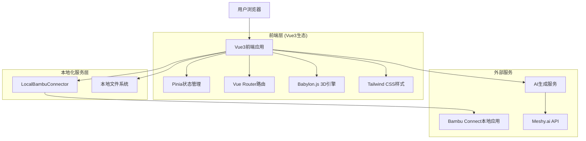
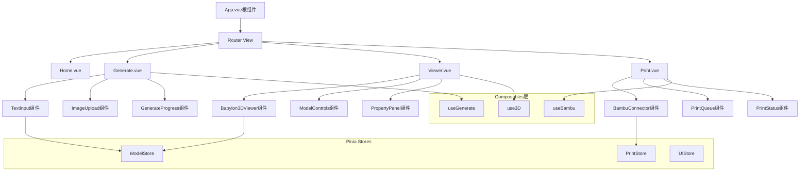

# 3D生成打印平台技术架构文档

## 1.Architecture design



## 2.Technology Description

- **Frontend**: Vue3@3.4 + TypeScript@5.0 + Vite@5.0
- **UI Framework**: Tailwind CSS + 自定义Vue组件
- **3D Engine**: Babylon.js@6.0
- **状态管理**: Pinia@2.1
- **路由管理**: Vue Router@4.2
- **HTTP客户端**: Axios
- **本地化集成**: LocalBambuConnector + URL Scheme
- **构建工具**: Vite (快速开发和构建)
- **类型检查**: TypeScript严格模式

## 3.Route definitions

| Route | Purpose | Vue组件 |
|-------|---------|---------|
| / | 主页面，项目入口和导航 | Home.vue |
| /generate | 3D生成页面，文本/图片转3D模型 | Generate.vue |
| /viewer | 全屏3D查看器，模型预览和编辑 | Viewer.vue |
| /print | 打印管理页面，Bambu Connect集成 | Print.vue |
| /library | 模型库，本地文件管理 | Library.vue |

## 4.Vue3 Composable API设计

### 4.1 核心Composable函数

**3D生成相关 (useGenerate.ts)**
```typescript
// 文本转3D模型
export function useTextTo3D() {
  const generateModel = async (prompt: string, options?: GenerateOptions) => {
    // 调用AI生成服务
  }
  
  const progress = ref(0)
  const status = ref<'idle' | 'generating' | 'completed' | 'error'>('idle')
  
  return { generateModel, progress, status }
}

// 图片转3D模型
export function useImageTo3D() {
  const generateFromImage = async (imageFile: File, options?: GenerateOptions) => {
    // 处理图片上传和生成
  }
  
  return { generateFromImage, progress, status }
}
```

**Bambu Connect集成 (useBambu.ts)**
```typescript
export function useBambuConnect() {
  const connector = new LocalBambuConnector()
  
  const sendToPrint = async (modelPath: string, options: PrintOptions) => {
    return await connector.sendToPrint(modelPath, options)
  }
  
  const checkBambuConnect = async () => {
    return await connector.checkBambuConnect()
  }
  
  return { sendToPrint, checkBambuConnect }
}
```

**3D查看器集成 (use3D.ts)**
```typescript
export function use3DViewer(canvasRef: Ref<HTMLCanvasElement>) {
  const engine = ref<Engine>()
  const scene = ref<Scene>()
  const camera = ref<Camera>()
  
  const initViewer = () => {
    // 初始化Babylon.js
  }
  
  const loadModel = async (modelUrl: string) => {
    // 加载3D模型
  }
  
  const exportSTL = () => {
    // 导出STL格式
  }
  
  return { initViewer, loadModel, exportSTL, scene }
}
```

### 4.2 Pinia状态管理

**模型状态管理 (stores/model.ts)**
```typescript
export const useModelStore = defineStore('model', () => {
  const currentModel = ref<Model3D | null>(null)
  const modelHistory = ref<Model3D[]>([])
  const generateTasks = ref<GenerateTask[]>([])
  
  const addModel = (model: Model3D) => {
    modelHistory.value.push(model)
    currentModel.value = model
  }
  
  return { currentModel, modelHistory, generateTasks, addModel }
})
```

**打印任务管理 (stores/print.ts)**
```typescript
export const usePrintStore = defineStore('print', () => {
  const printQueue = ref<PrintJob[]>([])
  const currentPrintJob = ref<PrintJob | null>(null)
  const bambuConnected = ref(false)
  
  const addPrintJob = (job: PrintJob) => {
    printQueue.value.push(job)
  }
  
  return { printQueue, currentPrintJob, bambuConnected, addPrintJob }
})
```

## 5.Vue3组件架构图



## 6.Vue3项目结构设计

### 6.1 目录结构定义
```
src/
├── App.vue                 # 根组件
├── main.ts                 # 应用入口
├── components/             # Vue组件
│   ├── 3d/                # 3D相关组件
│   │   ├── Babylon3DViewer.vue
│   │   ├── ModelControls.vue
│   │   └── PropertyPanel.vue
│   ├── ui/                # 通用UI组件
│   │   ├── Button.vue
│   │   ├── Modal.vue
│   │   └── ProgressBar.vue
│   ├── forms/             # 表单组件
│   │   ├── TextInput.vue
│   │   └── ImageUpload.vue
│   └── print/             # 打印相关组件
│       ├── BambuConnector.vue
│       ├── PrintQueue.vue
│       └── PrintStatus.vue
├── views/                 # 页面组件
│   ├── Home.vue
│   ├── Generate.vue
│   ├── Viewer.vue
│   ├── Print.vue
│   └── Library.vue
├── composables/           # 组合式函数
│   ├── useGenerate.ts
│   ├── use3D.ts
│   ├── useBambu.ts
│   └── useFileManager.ts
├── stores/                # Pinia状态管理
│   ├── model.ts
│   ├── print.ts
│   └── ui.ts
├── utils/                 # 工具函数
│   ├── fileUtils.ts
│   ├── 3dUtils.ts
│   └── bambuUtils.ts
├── types/                 # TypeScript类型定义
│   ├── model.ts
│   ├── print.ts
│   └── api.ts
└── assets/                # 静态资源
    ├── styles/
    └── images/
```

### 6.2 Vue3组件设计规范

**单文件组件结构**
```vue
<template>
  <!-- 模板使用Composition API风格 -->
  <div class="component-container">
    <!-- 使用Tailwind CSS类名 -->
  </div>
</template>

<script setup lang="ts">
// 使用<script setup>语法糖
import { ref, computed, onMounted } from 'vue'
import type { ComponentProps } from '@/types'

// Props定义
interface Props {
  modelId?: string
  options?: ComponentProps
}

const props = withDefaults(defineProps<Props>(), {
  modelId: '',
  options: () => ({})
})

// 响应式数据
const isLoading = ref(false)
const data = ref<any[]>([])

// 计算属性
const processedData = computed(() => {
  return data.value.filter(item => item.active)
})

// 生命周期
onMounted(() => {
  // 组件挂载后的逻辑
})

// 方法定义
const handleAction = () => {
  // 处理用户交互
}

// 暴露给父组件的方法
defineExpose({
  handleAction
})
</script>

<style scoped>
/* 使用Tailwind CSS优先，必要时添加scoped样式 */
.component-container {
  @apply flex flex-col space-y-4;
}
</style>
```

## 7.Vue3开发指导

### 7.1 项目初始化
```bash
# 使用Vite创建Vue3项目
npm create vue@latest 3d-printing-platform
cd 3d-printing-platform

# 安装依赖
npm install @babylonjs/core @babylonjs/loaders
npm install pinia vue-router@4
npm install axios
npm install tailwindcss @tailwindcss/forms
npm install @types/node typescript

# 开发工具
npm install -D @vitejs/plugin-vue
npm install -D eslint @typescript-eslint/parser
npm install -D prettier
```

### 7.2 Vite配置 (vite.config.ts)
```typescript
import { defineConfig } from 'vite'
import vue from '@vitejs/plugin-vue'
import { resolve } from 'path'

export default defineConfig({
  plugins: [vue()],
  resolve: {
    alias: {
      '@': resolve(__dirname, 'src'),
    },
  },
  server: {
    port: 3000,
    open: true,
  },
  build: {
    target: 'esnext',
    rollupOptions: {
      output: {
        manualChunks: {
          babylon: ['@babylonjs/core', '@babylonjs/loaders'],
          vue: ['vue', 'vue-router', 'pinia'],
        },
      },
    },
  },
})
```

### 7.3 TypeScript配置
```json
{
  "compilerOptions": {
    "target": "ES2020",
    "useDefineForClassFields": true,
    "lib": ["ES2020", "DOM", "DOM.Iterable"],
    "module": "ESNext",
    "skipLibCheck": true,
    "moduleResolution": "bundler",
    "allowImportingTsExtensions": true,
    "resolveJsonModule": true,
    "isolatedModules": true,
    "noEmit": true,
    "jsx": "preserve",
    "strict": true,
    "noUnusedLocals": true,
    "noUnusedParameters": true,
    "noFallthroughCasesInSwitch": true,
    "baseUrl": ".",
    "paths": {
      "@/*": ["src/*"]
    }
  },
  "include": ["src/**/*.ts", "src/**/*.d.ts", "src/**/*.tsx", "src/**/*.vue"],
  "references": [{ "path": "./tsconfig.node.json" }]
}
```

### 7.4 性能优化策略
- **代码分割**：使用defineAsyncComponent懒加载大型组件
- **3D优化**：Babylon.js场景优化，LOD技术，纹理压缩
- **状态管理**：合理使用Pinia Store，避免过度响应式
- **构建优化**：Vite Tree-shaking，依赖预构建
- **缓存策略**：HTTP缓存，Service Worker，本地存储