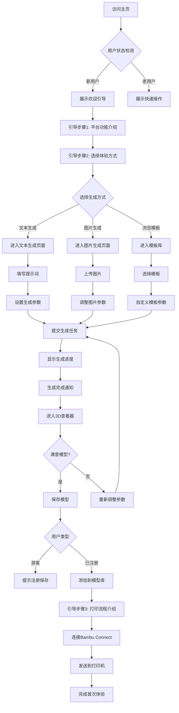
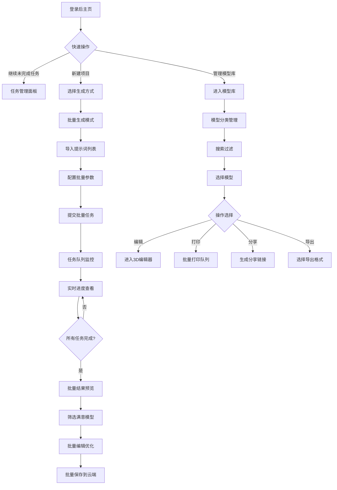
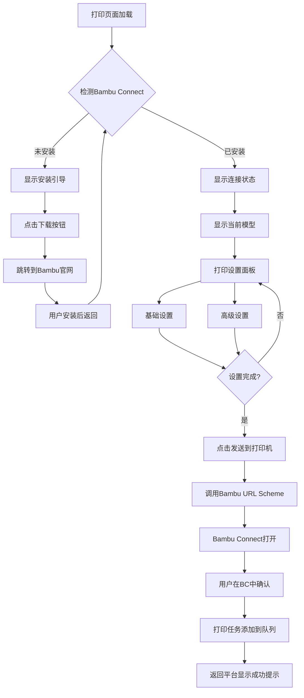

# 3D生成打印平台 - 用户交互UI流程设计文档

## 1. 文档概述

本文档详细描述3D生成打印平台的用户交互流程设计，包括完整的用户旅程、页面跳转逻辑、交互细节和状态变化。本文档与[产品需求文档](./3D生成打印平台产品需求文档.md)和[UI界面设计文档](./UI界面设计文档.md)紧密关联。

### 1.1 设计原则
- **简洁直观**：最小化学习成本，让用户快速上手
- **即时反馈**：每个操作都有清晰的视觉反馈
- **流畅体验**：页面切换流畅，加载过程可感知
- **容错设计**：友好的错误提示和恢复机制
- **引导式设计**：新用户有明确的操作指引

## 2. 核心用户旅程地图

### 2.1 新用户首次体验流程



### 2.2 高级用户工作流程



## 3. 详细页面交互流程

### 3.1 主页（Home.vue）

#### 3.1.1 页面结构
```
┌─────────────────────────────────────────────────────────────┐
│  顶部导航栏                                                  │
│  [Logo] [功能] [教程] [模型库]        [搜索] [用户] [主题]  │
├─────────────────────────────────────────────────────────────┤
│                                                              │
│  Hero区域                                                    │
│  ┌────────────────────────────────────────────────────┐    │
│  │  AI驱动的3D模型生成平台                            │    │
│  │  从想法到实物，只需几分钟                          │    │
│  │                                                    │    │
│  │  [开始创作] [观看演示]                             │    │
│  └────────────────────────────────────────────────────┘    │
│                                                              │
│  快速开始                                                    │
│  ┌──────────┐ ┌──────────┐ ┌──────────┐                   │
│  │ 文本生成 │ │ 图片生成 │ │ 模板选择 │                   │
│  │  [图标]  │ │  [图标]  │ │  [图标]  │                   │
│  └──────────┘ └──────────┘ └──────────┘                   │
│                                                              │
│  最近项目（已登录用户）                                      │
│  ┌─────┐ ┌─────┐ ┌─────┐ ┌─────┐                          │
│  │模型1│ │模型2│ │模型3│ │模型4│                          │
│  └─────┘ └─────┘ └─────┘ └─────┘                          │
│                                                              │
│  功能展示                                                    │
│  [AI生成] [3D查看] [在线编辑] [一键打印]                    │
└─────────────────────────────────────────────────────────────┘
```

#### 3.1.2 交互行为

##### 新用户引导弹窗
**触发条件**: 首次访问 || 清除Cookie后访问

**弹窗内容**:
```
┌─────────────────────────────────────┐
│  欢迎来到3D生成打印平台！            │
│                                     │
│  🎨 AI生成3D模型                    │
│  👁️ 专业3D查看器                    │
│  🖨️ 一键连接3D打印机                │
│                                     │
│  [开始体验] [观看教程] [跳过]       │
└─────────────────────────────────────┘
```

**用户操作路径**:
- 点击"开始体验" → 进入引导模式（高亮功能按钮）
- 点击"观看教程" → 播放产品介绍视频
- 点击"跳过" → 关闭弹窗，正常浏览

##### 快速开始按钮交互

**文本生成按钮**:
- **Hover状态**: 卡片上浮2px，阴影加深，背景渐变蓝色
- **Click事件**: 
  1. 按钮缩放动画（scale 0.95 → 1.05 → 1.0）
  2. 显示加载微动画（100ms）
  3. 页面淡出（200ms）
  4. 路由跳转 `/generate?mode=text`
  5. 新页面淡入（300ms）

**图片生成按钮**:
- 交互同上，跳转至 `/generate?mode=image`

**模板选择按钮**:
- 打开模态框，展示模板库
- 模板分类: 玩具、装饰品、工具、艺术品
- 点击模板 → 带参数跳转到生成页面

### 3.2 3D生成页面（Generate.vue）

#### 3.2.1 文本生成模式布局

```
┌─────────────────────────────────────────────────────────────┐
│  面包屑导航: 主页 > 3D生成 > 文本转3D                        │
├─────────────────┬───────────────────────────────────────────┤
│  输入面板       │  任务管理面板                             │
│                 │                                           │
│  [文本|图片]    │  当前任务队列                             │
│                 │  ┌───────────────────────────────────┐   │
│  提示词输入:    │  │ ⏱️ 任务1: 可爱的机器人            │   │
│  ┌───────────┐  │  │ 进度: ▓▓▓▓▓▓▓░░░ 70%            │   │
│  │           │  │  └───────────────────────────────────┘   │
│  │  描述你   │  │                                           │
│  │  想要的   │  │  历史任务                                 │
│  │  3D模型   │  │  ┌───────────────────────────────────┐   │
│  │           │  │  │ ✅ 任务2: 复古闹钟                │   │
│  │           │  │  │ [查看] [再次生成] [删除]         │   │
│  └───────────┘  │  └───────────────────────────────────┘   │
│                 │  ┌───────────────────────────────────┐   │
│  高级选项 ▼     │  │ ✅ 任务3: 卡通人物                │   │
│  ┌───────────┐  │  │ [查看] [再次生成] [删除]         │   │
│  │ AI模型    │  │  └───────────────────────────────────┘   │
│  │ 艺术风格  │  │                                           │
│  │ 分辨率    │  │                                           │
│  │ 面数      │  │                                           │
│  └───────────┘  │                                           │
│                 │                                           │
│  💡 提示词建议  │                                           │
│                 │                                           │
│  [生成3D模型]   │                                           │
└─────────────────┴───────────────────────────────────────────┘
```

#### 3.2.2 生成流程状态变化

##### 状态1: 输入阶段
**UI状态**:
- 输入框: 激活状态，蓝色边框
- 字数统计: 显示 "0/600"
- 生成按钮: 禁用状态（灰色）

**实时验证**:
```javascript
// 输入字符时
onInput: {
  - 更新字数统计
  - 字符 > 10 → 启用生成按钮
  - 字符 > 500 → 显示警告"建议精简描述"
  - 字符 = 600 → 阻止继续输入
}
```

**提示词建议**:
- 用户输入时，底部显示相关建议
- 点击建议 → 追加到输入框
- 建议示例:
  - "添加材质: 金属/塑料/木质"
  - "指定风格: 写实/卡通/抽象"
  - "描述细节: 纹理/颜色/尺寸"

##### 状态2: 生成中
**点击"生成3D模型"按钮后**:

**阶段1: 提交任务（0-2秒）**
```
┌─────────────────────────────────────┐
│  ⏳ 正在提交任务...                 │
│  [旋转的加载动画]                   │
└─────────────────────────────────────┘
```

**阶段2: 预览生成（2-180秒）**
```
┌─────────────────────────────────────┐
│  🎨 AI正在绘制3D模型预览             │
│                                     │
│  ▓▓▓▓▓▓▓▓▓▓░░░░░░░░░░ 50%          │
│                                     │
│  预计剩余时间: 1分30秒               │
│                                     │
│  💡 提示: 生成时间取决于模型复杂度   │
│                                     │
│  [取消生成] [最小化到后台]          │
└─────────────────────────────────────┘
```

**实时更新机制**:
- 每5秒轮询任务状态
- 进度条平滑动画（ease-in-out）
- 预估时间动态调整
- 后台生成时显示任务图标Badge

**阶段3: 精细化生成（可选，180-360秒）**
```
┌─────────────────────────────────────┐
│  ✨ 正在精细化模型细节               │
│                                     │
│  ▓▓▓▓▓▓▓░░░░░░░░░░░░░ 35%          │
│                                     │
│  正在处理:                          │
│  ✅ 网格优化                        │
│  ⏳ 纹理生成                        │
│  ⏸️ PBR材质                         │
│                                     │
│  [跳过精细化,使用预览版]            │
└─────────────────────────────────────┘
```

##### 状态3: 生成完成
**成功通知**:
```
┌─────────────────────────────────────┐
│  🎉 模型生成完成！                  │
│                                     │
│  [模型缩略图预览]                   │
│                                     │
│  可爱的机器人.glb                   │
│  面数: 30,000 | 大小: 2.4MB         │
│                                     │
│  [在3D查看器中打开]                 │
│  [下载模型] [重新生成]              │
└─────────────────────────────────────┘
```

**点击"在3D查看器中打开"**:
1. 弹出过渡动画（模型卡片放大）
2. 3D查看器全屏展开
3. 加载模型到场景
4. 播放模型入场动画

**失败处理**:
```
┌─────────────────────────────────────┐
│  ⚠️ 生成失败                        │
│                                     │
│  原因: 提示词包含不当内容            │
│                                     │
│  建议:                              │
│  • 修改提示词描述                   │
│  • 查看内容规范指南                 │
│  • 联系客服寻求帮助                 │
│                                     │
│  [修改提示词] [查看示例]            │
└─────────────────────────────────────┘
```

#### 3.2.3 图片生成模式

**上传交互流程**:

**步骤1: 选择上传方式**
```
┌─────────────────────────────────────┐
│  上传图片生成3D模型                  │
│                                     │
│  ┌─────────────┐ ┌───────────────┐ │
│  │   📁        │ │    📷         │ │
│  │ 选择文件    │ │  拍照上传     │ │
│  └─────────────┘ └───────────────┘ │
│                                     │
│  或拖拽图片到此区域                  │
│                                     │
│  支持格式: JPG, PNG (最大10MB)      │
└─────────────────────────────────────┘
```

**步骤2: 图片预处理**
- 上传后立即显示缩略图
- 自动裁剪为正方形（可调整）
- 智能去背景选项
- 对比度/亮度调整滑块

**步骤3: AI参数设置**
```
┌─────────────────────────────────────┐
│  [图片预览 500x500]                 │
│                                     │
│  生成模式:                          │
│  ○ 仅几何形状                       │
│  ● 包含纹理                         │
│                                     │
│  模型质量:                          │
│  ○ 快速 (5-10分钟)                 │
│  ● 标准 (10-20分钟)                │
│  ○ 高质量 (20-30分钟)              │
│                                     │
│  [开始生成]                         │
└─────────────────────────────────────┘
```

### 3.3 全屏3D查看器（Viewer.vue）

#### 3.3.1 查看器布局详解

```
┌─────────────────────────────────────────────────────────────┐
│ ⬅️ [返回]  可爱的机器人.glb            [全屏] [设置] [分享] │
├───┬─────────────────────────────────────────────────────┬───┤
│   │                                                     │   │
│ 文│                                                     │ 属│
│ 件│                                                     │ 性│
│ 树│            [3D渲染区域]                             │ 面│
│   │                                                     │ 板│
│ 📁│            [模型在此旋转展示]                       │   │
│ │─│                                                     │ 📐│
│ └─│                                                     │ 位│
│ 模│                                                     │ 置│
│ 型│                                                     │   │
│ 1 │                                                     │ 🎨│
│   │                                                     │ 材│
│   │           [视角控制器悬浮在右侧]                    │ 质│
│   │            [前][后][左][右]                         │   │
│   │                                                     │   │
├───┴─────────────────────────────────────────────────────┴───┤
│ [回原点] [旋转] [测量] [平移] [创建] [上色] [全屏] [设置]  │
└─────────────────────────────────────────────────────────────┘
```

#### 3.3.2 3D交互操作说明

##### 基础交互
| 操作 | 鼠标 | 触摸 | 快捷键 | 效果 |
|------|------|------|--------|------|
| 旋转视角 | 左键拖拽 | 单指滑动 | Alt+拖拽 | 围绕模型旋转相机 |
| 平移视角 | 右键拖拽 | 双指滑动 | Shift+拖拽 | 平行移动相机 |
| 缩放 | 滚轮 | 双指捏合 | +/- | 拉近/推远模型 |
| 聚焦 | 双击模型 | 双击 | F | 相机聚焦到模型中心 |
| 重置视角 | 点击"回原点" | - | Home | 恢复默认视角 |

##### 高级工具交互

**1. 测量工具（M键激活）**

**使用流程**:
```
点击"测量"按钮
    ↓
鼠标变为十字准星
    ↓
点击模型上第一个点 → 显示红色标记点
    ↓
移动鼠标 → 显示虚线和实时距离
    ↓
点击第二个点 → 显示测量结果
    ↓
┌────────────────┐
│ 📏 测量结果    │
│ 距离: 45.2mm   │
│ [保存] [清除]  │
└────────────────┘
```

**视觉反馈**:
- 测量点: 红色小球 + 数字标签
- 测量线: 黄色虚线
- 距离标注: 白色背景半透明标签
- 单位自动切换: mm/cm/m

**2. 自由上色工具**

**交互流程**:
```
点击"自由上色"
    ↓
左侧弹出色板面板
┌──────────────────┐
│ 🎨 颜色选择      │
│ [色环选择器]     │
│ 常用颜色:        │
│ ⬜⬜⬜⬜⬜      │
│                  │
│ 画笔大小: ●     │
│ ├─────────┤     │
│                  │
│ 不透明度: 100%  │
│ ├─────────┤     │
│                  │
│ [应用] [重置]    │
└──────────────────┘
```

**绘制体验**:
- 鼠标移到模型上 → 显示圆形画笔预览
- 点击拖拽 → 实时着色
- 按住Shift → 直线绘制模式
- Ctrl+Z → 撤销上一步
- Ctrl+Y → 重做

**3. 模型编辑工具**

**变换控制**:
```
选中模型
    ↓
显示变换控制器
    ↓
┌───────────────┐
│ 🔧 变换模式   │
│ ○ 移动 (G)   │
│ ○ 旋转 (R)   │
│ ○ 缩放 (S)   │
└───────────────┘
```

**精确输入**:
```
右侧属性面板实时更新:

位置:
X: [  0.00  ] mm
Y: [ 15.50  ] mm
Z: [ -3.20  ] mm

旋转:
X: [ 0.0 ] °
Y: [ 45.0 ] °
Z: [ 0.0 ] °

缩放:
统一缩放: [√] 100%
X: [ 100 ] %
Y: [ 100 ] %
Z: [ 100 ] %
```

#### 3.3.3 查看器进阶功能

##### 快照功能
**触发**: 点击相机图标 / 按Ctrl+P

**快照设置弹窗**:
```
┌─────────────────────────────┐
│ 📸 生成快照                 │
│                             │
│ 分辨率:                     │
│ ○ 1920x1080                │
│ ● 3840x2160 (4K)           │
│ ○ 自定义                   │
│                             │
│ 背景:                       │
│ ● 透明                     │
│ ○ 白色                     │
│ ○ 当前场景                 │
│                             │
│ 包含:                       │
│ [√] 网格                   │
│ [√] 轴线                   │
│ [√] 阴影                   │
│                             │
│ [生成] [取消]               │
└─────────────────────────────┘
```

**生成后操作**:
```
┌─────────────────────────────┐
│ ✅ 快照已生成               │
│                             │
│ [预览图 800x450]            │
│                             │
│ screenshot_001.png          │
│ 4K分辨率 | 2.1MB            │
│                             │
│ [下载] [复制到剪贴板]       │
│ [设为缩略图] [分享]         │
└─────────────────────────────┘
```

##### 导出功能
**触发**: 文件菜单 > 导出

**导出选项**:
```
┌─────────────────────────────┐
│ 💾 导出3D模型               │
│                             │
│ 格式选择:                   │
│ ● GLB (推荐)               │
│ ○ FBX                      │
│ ○ OBJ                      │
│ ○ STL (3D打印)             │
│ ○ USDZ (AR)                │
│                             │
│ 质量设置:                   │
│ 面数优化: [√]              │
│ 目标面数: [30000]          │
│                             │
│ 纹理压缩: [√]              │
│ 贴图尺寸: 2048x2048        │
│                             │
│ 包含内容:                   │
│ [√] 几何体                 │
│ [√] 材质                   │
│ [√] 纹理                   │
│ [√] 动画 (如有)            │
│                             │
│ [导出] [取消]               │
└─────────────────────────────┘
```

### 3.4 打印管理页面（Print.vue）

#### 3.4.1 Bambu Connect集成流程



#### 3.4.2 打印设置界面

```
┌─────────────────────────────────────────────────────────────┐
│  Bambu Connect 打印管理                                      │
├─────────────────────────────────────────────────────────────┤
│                                                              │
│  连接状态                                                    │
│  ┌────────────────────────────────────────────────────────┐ │
│  │ ✅ Bambu Connect 已连接                                │ │
│  │ 版本: v1.2.3                                           │ │
│  │ 检测到的打印机: Bambu Lab P1S                          │ │
│  │                                                        │ │
│  │ [刷新连接] [设置]                                      │ │
│  └────────────────────────────────────────────────────────┘ │
│                                                              │
│  当前模型                                                    │
│  ┌────────────────────────────────────────────────────────┐ │
│  │ [模型预览 300x300]   可爱的机器人.glb                 │ │
│  │                      尺寸: 80x65x95mm                  │ │
│  │                      体积: 245cm³                      │ │
│  │                      重量: ~18g (PLA)                  │ │
│  └────────────────────────────────────────────────────────┘ │
│                                                              │
│  ┌────────────────────────┐ ┌──────────────────────────────┐ │
│  │ 基础设置               │ │ 高级设置                     │ │
│  │                        │ │                              │ │
│  │ 材料类型:              │ │ 壁厚: [3] 层                │ │
│  │ [PLA  ▼]              │ │                              │ │
│  │                        │ │ 顶/底层: [5] 层            │ │
│  │ 层高:                  │ │                              │ │
│  │ ○ 0.10mm (精细)       │ │ 支撑类型:                   │ │
│  │ ● 0.20mm (标准)       │ │ ● 自动                     │ │
│  │ ○ 0.28mm (快速)       │ │ ○ 树状                     │ │
│  │                        │ │ ○ 无                       │ │
│  │ 填充密度:              │ │                              │ │
│  │ ├────●────┤ 20%       │ │ 打印速度: 正常              │ │
│  │                        │ │                              │ │
│  │ 支撑结构:              │ │ 底板附着:                   │ │
│  │ [√] 启用              │ │ ● Brim (推荐)              │ │
│  │                        │ │ ○ Raft                     │ │
│  │ 平台附着:              │ │ ○ Skirt                    │ │
│  │ [√] 启用底筏          │ │                              │ │
│  └────────────────────────┘ └──────────────────────────────┘ │
│                                                              │
│  预估信息                                                    │
│  ┌────────────────────────────────────────────────────────┐ │
│  │ ⏱️ 打印时间: 2小时15分                                 │ │
│  │ 📏 耗材长度: 12.5m                                    │ │
│  │ ⚖️ 耗材重量: 18g                                      │ │
│  │ 💰 预估成本: ¥3.60 (按PLA ¥0.20/g)                   │ │
│  └────────────────────────────────────────────────────────┘ │
│                                                              │
│  ┌──────────────────────────────────────────────────────┐   │
│  │              [发送到 Bambu Connect]                  │   │
│  └──────────────────────────────────────────────────────┘   │
└─────────────────────────────────────────────────────────────┘
```

#### 3.4.3 发送到Bambu Connect流程

**步骤1: 用户点击"发送到Bambu Connect"**

**加载状态**:
```
┌─────────────────────────────┐
│ ⏳ 准备文件中...            │
│                             │
│ [进度条动画]                │
│                             │
│ 正在处理:                   │
│ ✅ 模型验证                 │
│ ⏳ 切片处理                 │
│ ⏸️ 文件压缩                 │
└─────────────────────────────┘
```

**步骤2: 调用URL Scheme**

```javascript
// 自动触发
bambu-connect://import-file?
  path=/tmp/cute_robot.gcode.3mf
  &name=可爱的机器人
  &version=1.0.0
```

**步骤3: Bambu Connect响应**

**Bambu Connect窗口自动打开**:
```
┌─────────────────────────────────────┐
│ Bambu Connect                       │
├─────────────────────────────────────┤
│ 收到来自3D生成平台的打印任务        │
│                                     │
│ 文件: 可爱的机器人.gcode.3mf        │
│ 大小: 4.2MB                         │
│                                     │
│ 预估打印时间: 2小时15分             │
│                                     │
│ 选择打印机:                         │
│ ● Bambu Lab P1S [在线]             │
│ ○ Bambu Lab A1 [离线]              │
│                                     │
│ [添加到队列] [立即打印] [取消]     │
└─────────────────────────────────────┘
```

**步骤4: 平台确认**

**平台显示成功提示**:
```
┌─────────────────────────────────────┐
│ ✅ 已发送到 Bambu Connect           │
│                                     │
│ 请在 Bambu Connect 中完成打印设置   │
│                                     │
│ [打开 Bambu Connect] [完成]        │
└─────────────────────────────────────┘
```

**错误处理示例**:
```
┌─────────────────────────────────────┐
│ ⚠️ 无法连接 Bambu Connect           │
│                                     │
│ 原因: 应用程序未响应                │
│                                     │
│ 解决方案:                           │
│ 1. 确认 Bambu Connect 已安装       │
│ 2. 检查应用是否正在运行             │
│ 3. 重启 Bambu Connect              │
│                                     │
│ [重试] [下载 Bambu Connect]        │
└─────────────────────────────────────┘
```

### 3.5 模型库页面（Library.vue）

#### 3.5.1 模型库布局

```
┌─────────────────────────────────────────────────────────────┐
│  我的模型库                                                  │
│  ┌───────────────────────────────────┐  [导入] [新建文件夹] │
│  │ 🔍 搜索模型...                    │                      │
│  └───────────────────────────────────┘                      │
├───────────────┬─────────────────────────────────────────────┤
│ 📁 文件夹     │  ┌─────┐ ┌─────┐ ┌─────┐ ┌─────┐           │
│  ├─ 📂 全部   │  │     │ │     │ │     │ │     │           │
│  ├─ 📂 玩具   │  │模型1│ │模型2│ │模型3│ │模型4│           │
│  ├─ 📂 装饰品 │  │     │ │     │ │     │ │     │           │
│  ├─ 📂 工具   │  │[✓]  │ │     │ │     │ │     │           │
│  └─ 📂 收藏   │  └─────┘ └─────┘ └─────┘ └─────┘           │
│               │                                             │
│ 🏷️ 标签      │  ┌─────┐ ┌─────┐ ┌─────┐ ┌─────┐           │
│  • 最近       │  │     │ │     │ │     │ │     │           │
│  • 收藏       │  │模型5│ │模型6│ │模型7│ │模型8│           │
│  • 已打印     │  │     │ │     │ │     │ │     │           │
│               │  └─────┘ └─────┘ └─────┘ └─────┘           │
│ 📊 排序       │                                             │
│  ○ 最新      │  [显示更多]                                 │
│  ● 名称      │                                             │
│  ○ 大小      │                                             │
│  ○ 类型      │                                             │
└───────────────┴─────────────────────────────────────────────┘
```

#### 3.5.2 模型卡片交互

**正常状态（Hover前）**:
```
┌─────────────┐
│             │
│  [缩略图]   │
│             │
├─────────────┤
│ 机器人.glb  │
│ 2.4MB       │
└─────────────┘
```

**Hover状态**:
```
┌─────────────┐
│ [✓] [★]  [⋮]│ ← 快捷操作浮现
│  [缩略图]   │ ← 轻微放大+阴影加深
│  [预览按钮] │ ← 显示预览按钮
├─────────────┤
│ 机器人.glb  │
│ 2.4MB       │
│ 2024-10-24  │ ← 显示详细信息
└─────────────┘
```

**选中状态**:
```
┌─────────────┐
│ [✓] [★]  [⋮]│
│  [缩略图]   │ ← 蓝色边框
│  [✓ 已选中] │
├─────────────┤
│ 机器人.glb  │
│ 2.4MB       │
└─────────────┘
```

**右键菜单**:
```
┌─────────────────┐
│ 👁️ 预览         │
│ ✏️ 重命名       │
│ 📋 复制         │
│ 🗑️ 删除         │
│ ────────────    │
│ 📤 导出         │
│ 🖨️ 打印         │
│ 🔗 分享链接     │
│ ────────────    │
│ 📂 移动到...    │
│ 🏷️ 添加标签     │
│ ⭐ 添加到收藏   │
│ ────────────    │
│ ℹ️ 属性         │
└─────────────────┘
```

#### 3.5.3 批量操作模式

**进入批量模式**: 点击顶部"选择"按钮或选中任意一个模型

**批量操作工具栏**:
```
┌─────────────────────────────────────────────────────────────┐
│ [✓] 已选择 3 个模型                                         │
│                                                              │
│ [全选] [取消] │ [下载] [打印] [移动到] [删除]   [退出选择] │
└─────────────────────────────────────────────────────────────┘
```

**批量打印确认**:
```
┌─────────────────────────────┐
│ 🖨️ 批量打印确认             │
│                             │
│ 已选择 3 个模型:            │
│ • 机器人.glb                │
│ • 花瓶.glb                  │
│ • 齿轮.glb                  │
│                             │
│ 打印顺序:                   │
│ ● 按选择顺序                │
│ ○ 按大小排序                │
│ ○ 按时间排序                │
│                             │
│ 预估总时间: 6小时30分       │
│ 预估总耗材: 54g             │
│                             │
│ [确认发送] [取消]           │
└─────────────────────────────┘
```

## 4. 通用交互模式

### 4.1 加载状态设计

#### 页面级加载
```
┌─────────────────────────────┐
│                             │
│      [旋转的3D Logo]        │
│                             │
│      正在加载...            │
│                             │
└─────────────────────────────┘
```

#### 组件级加载（骨架屏）
```
┌─────────────────────────────┐
│ ░░░░░░░░░░░░░░░░            │ ← 标题骨架
│ ░░░░░░░░░░░░                │ ← 副标题骨架
│                             │
│ ░░░░░░░░  ░░░░░░░░          │ ← 内容骨架
│ ░░░░░░░░  ░░░░░░░░          │
│ ░░░░░░░░  ░░░░░░░░          │
│                             │
│ ░░░░░░░░░░░░                │ ← 按钮骨架
└─────────────────────────────┘
```

#### 进度条加载
```
正在生成模型...
▓▓▓▓▓▓▓▓▓▓░░░░░░░░░░ 50%
预计剩余: 1分30秒
```

### 4.2 通知系统

#### Toast通知（右上角）

**成功通知**:
```
┌────────────────────────┐
│ ✅ 操作成功            │
│ 模型已保存到库中       │
└────────────────────────┘
```
- 显示时长: 3秒
- 自动淡出
- 可点击关闭

**警告通知**:
```
┌────────────────────────┐
│ ⚠️ 注意                │
│ 剩余积分不足           │
│ [立即充值]             │
└────────────────────────┘
```
- 显示时长: 5秒
- 需手动关闭或点击按钮

**错误通知**:
```
┌────────────────────────┐
│ ❌ 操作失败            │
│ 文件上传超时           │
│ [重试] [取消]          │
└────────────────────────┘
```
- 显示时长: 不自动关闭
- 必须手动处理

#### 模态确认对话框

**删除确认**:
```
┌─────────────────────────────┐
│ ⚠️ 确认删除                 │
│                             │
│ 确定要删除 "机器人.glb"?    │
│ 此操作无法撤销。            │
│                             │
│ [取消] [确定删除]           │
└─────────────────────────────┘
```

### 4.3 响应式布局适配

#### 桌面端 (≥1024px)
- 完整功能展示
- 侧边栏默认展开
- 多列网格布局
- 悬浮工具栏

#### 平板端 (768px-1023px)
- 侧边栏可折叠
- 双列网格布局
- 部分功能收起到下拉菜单

#### 移动端 (<768px)
```
┌─────────────────┐
│ ☰ 3D平台   👤  │ ← 汉堡菜单 + 用户
├─────────────────┤
│                 │
│  [主要内容区]   │
│                 │
│                 │
│                 │
├─────────────────┤
│ [🏠] [➕] [📚]  │ ← 底部导航
└─────────────────┘
```

**底部导航**:
- 🏠 主页
- ➕ 新建生成
- 👁️ 3D查看器
- 📚 模型库
- 👤 个人中心

### 4.4 无障碍设计

#### 键盘导航
- **Tab**: 焦点移动到下一个可交互元素
- **Shift+Tab**: 焦点移动到上一个元素
- **Enter/Space**: 激活当前焦点元素
- **Esc**: 关闭弹窗/退出当前模式
- **Arrow Keys**: 在列表/网格中导航

#### 焦点指示器
```
┌─────────────────────────┐
│ 生成3D模型              │ ← 蓝色发光边框
└─────────────────────────┘
```

#### 屏幕阅读器支持
- 所有图标配alt文本
- 表单元素有label
- ARIA标签完整
- 语义化HTML结构

### 4.5 深色模式

#### 自动切换
- 检测系统主题
- 保存用户偏好
- 实时切换（无刷新）

#### 色彩适配
| 元素 | 浅色模式 | 深色模式 |
|------|----------|----------|
| 主背景 | #ffffff | #0f172a |
| 卡片背景 | #f8fafc | #1e293b |
| 文字 | #0f172a | #f1f5f9 |
| 边框 | #e2e8f0 | #334155 |
| 主色调 | #2563eb | #3b82f6 |

## 5. 错误处理和边界情况

### 5.1 网络错误

**离线状态检测**:
```
┌─────────────────────────────┐
│ 🔌 网络连接已断开           │
│                             │
│ 正在等待网络恢复...         │
│ [离线模式] [重试连接]       │
└─────────────────────────────┘
```

**离线模式功能**:
- ✅ 浏览已下载的模型
- ✅ 在3D查看器中查看本地模型
- ❌ 生成新模型
- ❌ 上传/同步
- 网络恢复后自动同步待上传内容

### 5.2 文件处理错误

**文件过大**:
```
┌─────────────────────────────┐
│ ⚠️ 文件过大                 │
│                             │
│ 文件大小: 15MB              │
│ 最大限制: 10MB              │
│                             │
│ 建议:                       │
│ • 压缩图片质量              │
│ • 裁剪图片尺寸              │
│ • 使用其他格式              │
│                             │
│ [重新选择] [了解更多]       │
└─────────────────────────────┘
```

**文件格式不支持**:
```
┌─────────────────────────────┐
│ ⚠️ 不支持的文件格式         │
│                             │
│ 当前格式: .bmp              │
│                             │
│ 支持的格式:                 │
│ • 图片: JPG, PNG, WEBP      │
│ • 3D模型: GLB, FBX, OBJ     │
│                             │
│ [转换格式] [选择其他文件]   │
└─────────────────────────────┘
```

### 5.3 生成失败处理

**积分不足**:
```
┌─────────────────────────────┐
│ 💰 积分不足                 │
│                             │
│ 所需积分: 20                │
│ 当前积分: 5                 │
│                             │
│ 升级到高级用户可享:         │
│ • 无限次生成                │
│ • 高质量模型                │
│ • 优先队列                  │
│                             │
│ [查看套餐] [充值积分]       │
└─────────────────────────────┘
```

**内容审核失败**:
```
┌─────────────────────────────┐
│ ⚠️ 内容不符合规范           │
│                             │
│ 您的提示词包含不当内容。    │
│                             │
│ 请修改后重试:               │
│ • 避免暴力/色情内容         │
│ • 避免版权侵犯              │
│ • 避免政治敏感内容          │
│                             │
│ [修改提示词] [查看规范]     │
└─────────────────────────────┘
```

### 5.4 打印错误处理

**打印机离线**:
```
┌─────────────────────────────┐
│ 🖨️ 打印机离线               │
│                             │
│ 无法连接到 Bambu Lab P1S    │
│                             │
│ 请检查:                     │
│ • 打印机是否开机            │
│ • 网络连接是否正常          │
│ • 打印机是否在同一局域网    │
│                             │
│ [刷新连接] [切换打印机]     │
└─────────────────────────────┘
```

## 6. 性能优化策略

### 6.1 首屏加载优化
- **代码分割**: 路由级懒加载
- **关键CSS内联**: 首屏样式优先加载
- **图片懒加载**: 视口外图片延迟加载
- **预加载关键资源**: `<link rel="preload">`

### 6.2 3D渲染优化
- **LOD技术**: 根据距离切换模型精度
- **视锥剔除**: 只渲染视野内的物体
- **纹理压缩**: 使用压缩纹理格式
- **实例化渲染**: 相同模型批量渲染

### 6.3 交互流畅度保障
- **防抖/节流**: 高频事件优化
- **虚拟滚动**: 大列表性能优化
- **RequestAnimationFrame**: 动画性能优化
- **Web Workers**: 耗时计算后台处理

## 7. 数据埋点与分析

### 7.1 关键用户行为追踪
- 页面访问路径
- 功能使用频率
- 生成成功率
- 打印成功率
- 用户留存率

### 7.2 性能监控指标
- 首屏加载时间 (FCP)
- 可交互时间 (TTI)
- 3D模型加载时间
- API响应时间
- 错误发生率

## 8. 总结

本用户交互UI流程文档详细描述了3D生成打印平台的完整用户旅程，包括:
- ✅ 5个核心页面的详细交互流程
- ✅ 完整的状态变化和视觉反馈
- ✅ Bambu Connect集成的具体步骤
- ✅ 错误处理和边界情况处理
- ✅ 响应式设计和无障碍支持
- ✅ 性能优化策略

配合[产品需求文档](./3D生成打印平台产品需求文档.md)、[UI界面设计文档](./UI界面设计文档.md)和[技术架构文档](./3D生成打印平台技术架构文档.md)，可以指导团队进行高质量的产品实现。
